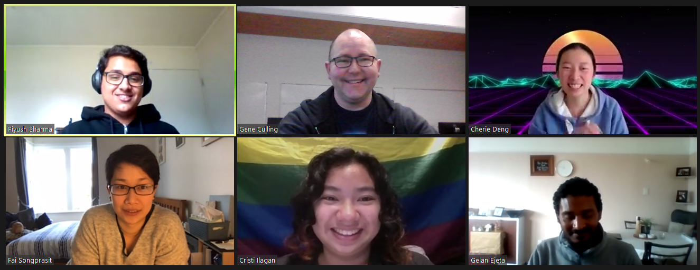
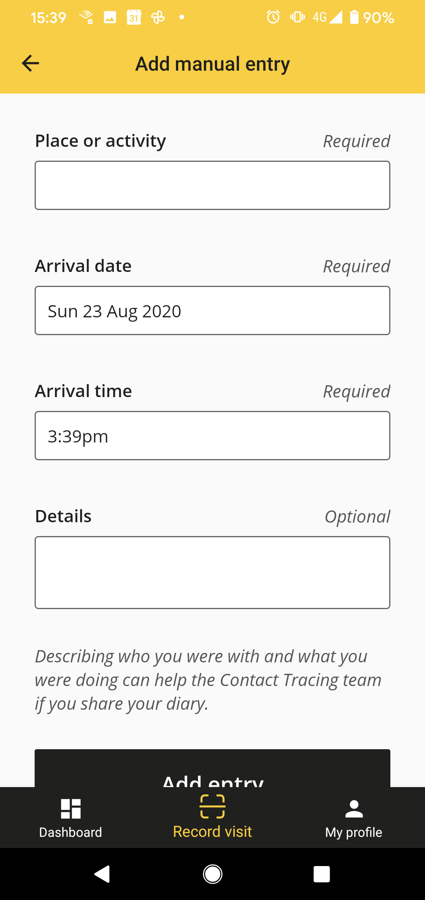

# COVID Tracker For Transit
Project completed as part of *Summer of Tech - Create Camp Hackathon 2020 Wellington*

# Team - Won Direction

| Position                          | Name              |
| --------------------------------- | ----------------- |
| Mentor                            | Kimberley Hayward |
| Designer / Thinker                | Piyush Sharma     |
| Coder                             | Gelan Ejeta       |
| Coder                             | Fai Songprasit    |
| Coder                             | Cherie Deng       |
| Coder                             | Gene Culling      |
| Extra  Designer / Thinker / Coder | Cristi ilagan     |

Special thanks to Kimberley Hayward, Jeremy Shipman, and Prae Songprasit

## Problem
### Background
The spread of COVID through the community is a serious danger, at the moment Auckland is at alert level 3 and the rest of New Zealand is at alert level 2. Tracking and tracing contacts with COVID positive cases is an important part of the response to tackle the outbreak, part of that effort is the use of tools like the NZ COVID Tracer app, allowing for visits to locations to be easily recorded. 

Unfortunately recording trips on the NZ COVID Tracer app is difficult and time consuming, this is a problem both for the user experience and for efforts to track contacts when people ignore the manual process. Some information about trips can be found through various payments and additional apps(Snapper, Uber), but there is no central location or app for all of this trip data. Additionally there are trips that may not be covered by these existing systems, examples include travel on any transit system based on tickets, trips by the elderly (which are especially vulnerable) using the SuperGold Card, and trips with friends or aquaintances.

### Existing NZ COVID Tracer application
<!--  -->
#### Problems with the existing app
+ To track transit with no QR code requires users to fill out the manual page
+ The manual page is a lot of work, and there is no guidance on how to fill it out for transit
+ Tracking may be done via Snapper in Wellington, but not all people use Snapper
+ If someone on a shared trip tests positive for COVID it can be very difficult to find and notify the other riders

## Solution
### MVP
The MVP for this app, is to have a list of the trips made and the vehicle reference.

The goal is for the data to all be stored locally to improve security, with no central database of trip information or personal details stored off the device.

In this stage the saving and loading of data is central. Trips use the Metlink API to identify services near the user (via gps) for the selected route.

#### Key points
+ Acts as a travel diary if a Ministry of Health official needs to find information related to travel in person
+ The user can see their previous trips
+ All data is stored locally
+ The trip is based on the route number and the specific service
+ The vehicle they are traveling on is uniquely identified

### Stage 2 (In Development)
+ Notifications of online users when someone with a shared trip has tested positive
+ Registration numbers can be added for tracking ridesharing
+ Additional information can be kept with the trip to include notes - e.g. traveling with three children without mobile phones

#### Key points
+ Uses socket.io for real time push
+ No user specific data is transferred - only trips which had a person who tested COVID positive

## Final Goal
Ideally these ideas are integrated with the existing NZ COVID Tracer app making it easy for to record transit information. This will help community members feel they have a full and accurate record of their possible exposures and help ensure that people keep using the application.

# Create Camp Criteria

## Three C's for the focuses of Create Camp 2020
+ Customers
+ Community
+ Cloud

## Design ( 5 pts )
### End Product
+	Does it fit in (loosely) with our 2020 themes: Customer, Community?
+	Does it deliver a compelling and captivating user experience? 
+	Were design best practices and guidelines used? (accessible, responsive)
+	Does it have a professional look and feel?
### Design Process
+	Was there design iteration during the project?
+	How well was the user experience tested?
+	How well was feedback incorporated into the application?

## Execution ( 10 pts )
+	Does the app work?
+	Did the story/app/product make sense?
+	Was the project goal accomplished?
    +	Technical difficulty and complexity of the project
    +	Level of detail achieved
+	Was one or more APIs/Datasets used, including at least one from NZ?
+	Have they established a "Minimal Viable Product" for the weekend?

## Impact and Innovation ( 5 pts )
+	Is the project a unique take on the data chosen?
+	Would people use this or find this interesting in real life?
+	How much would it affect users who did?
+	Does the project have follow-up options or growth/pivot/extension potential?
+	Is it memorable? 
**Note: projects don’t have to have a specific money making model to have impact, but having business potential would be one method of demonstrating impact.**

## Technology & Process (10 pts)
### Technological Choices
+	Were the right tooling/libraries used for the problem space?
+	Did they explore/experience our 2020 theme: Cloud?
### Development
+	How detailed an accounting of the good and bad things in the codebase has taken place? Ie How transparent has the group been about the things they’re proud of, and the things they know could be better next time?
+	How functional is the thing that was built? Does it do what it’s supposed to do? Are there any glaring bugs visible?
+	What was the testing methodology? More points should be awarded for testing the prototype with users in real time, rather than testing with unit or integration tests, although the presence of these things should be worth more then if there are none
### Process
+	Is there evidence of an agile mindset & tools?
+	How did the team work together?
